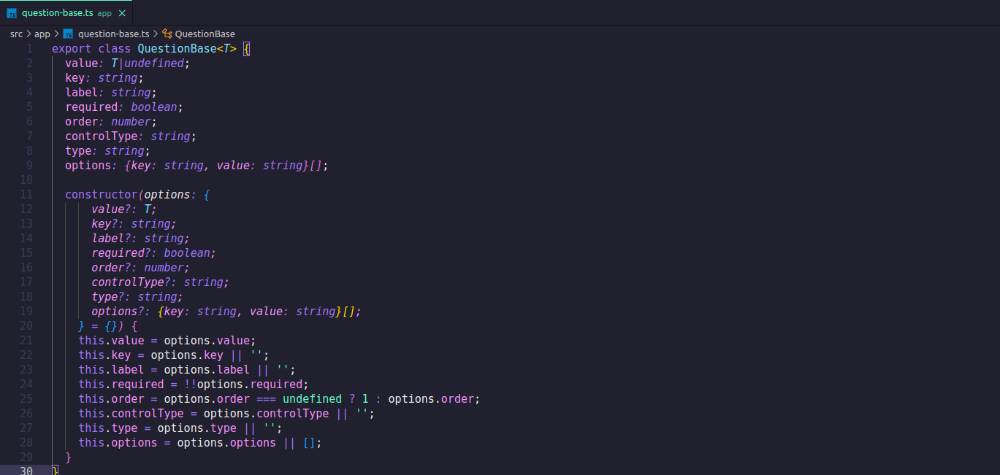
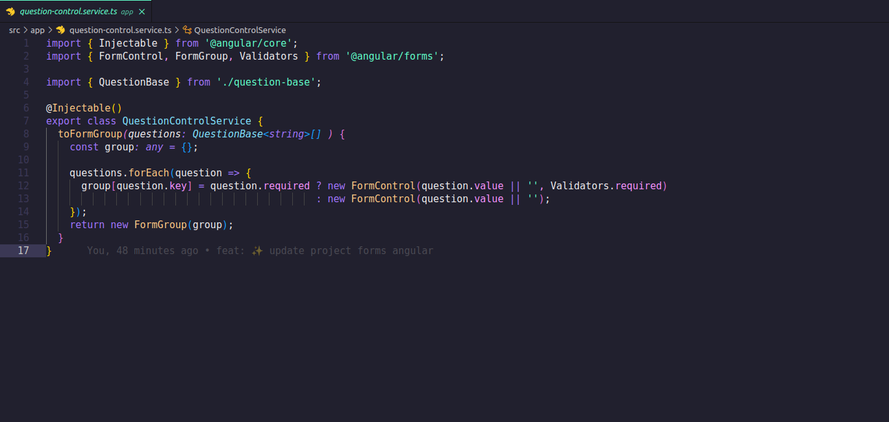
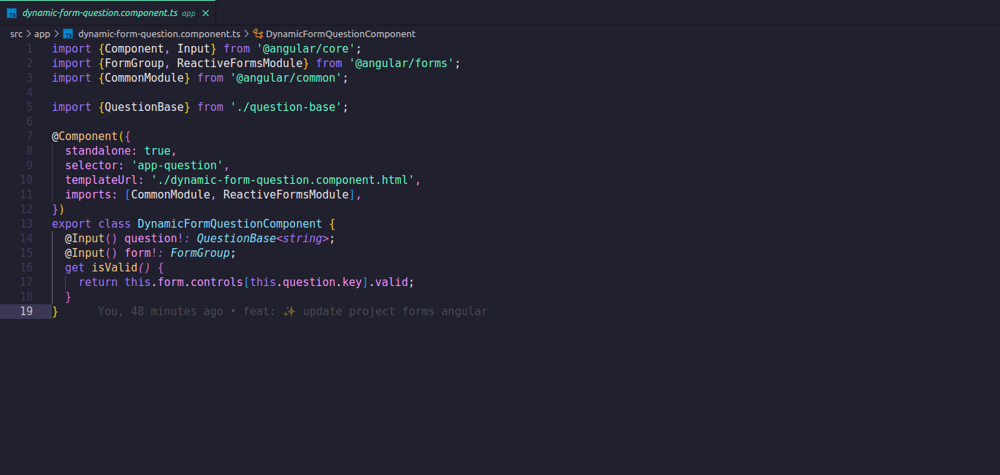
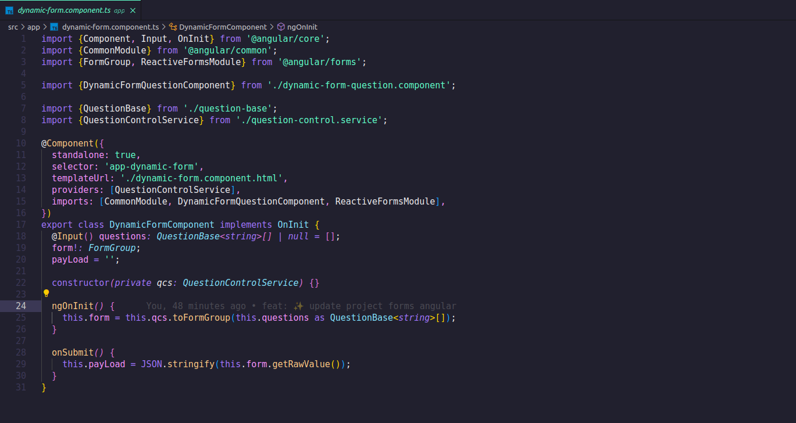
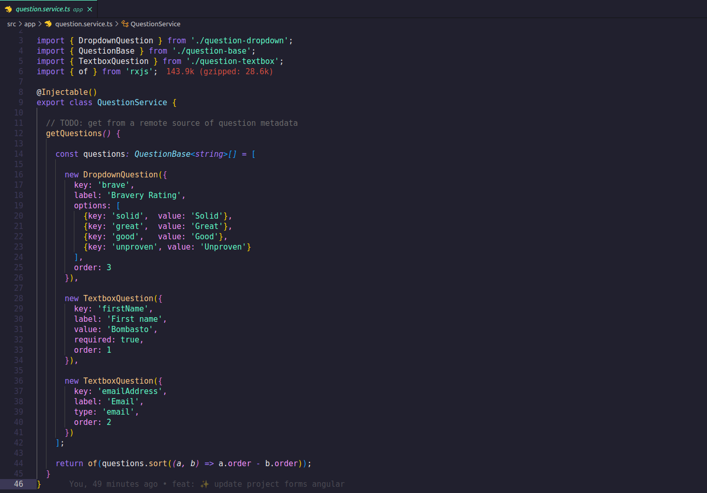
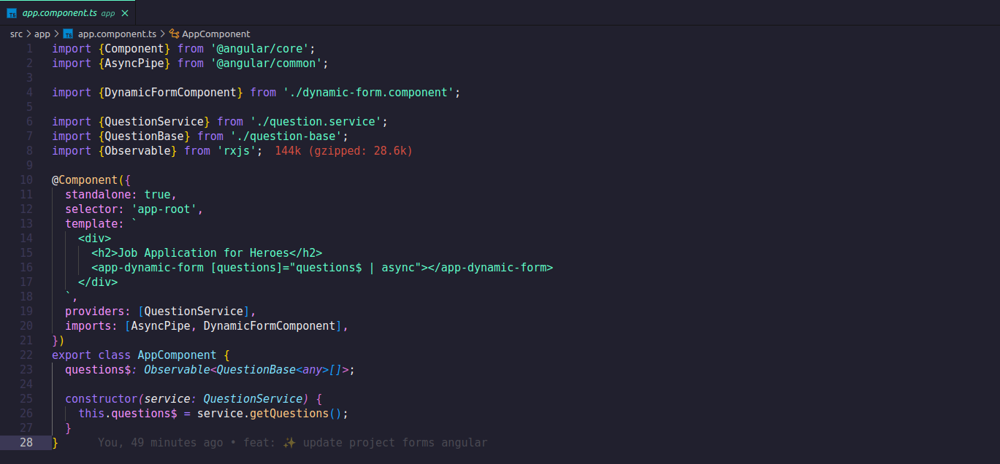
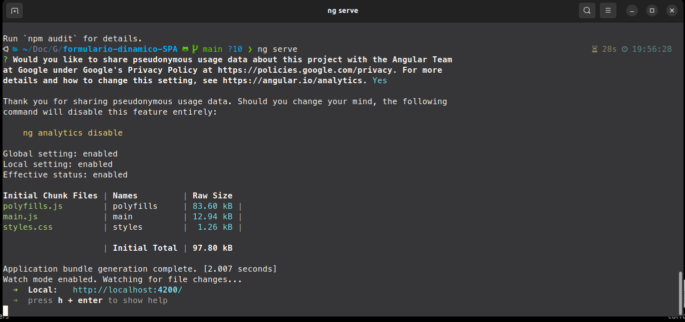
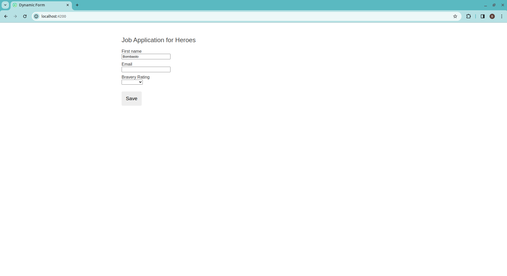

# Formulários Dinâmicos em Angular

## Introdução
Angular é um framework de desenvolvimento frontend mantido pelo Google, que permite a criação de aplicações web robustas e escaláveis. Ele utiliza a linguagem TypeScript para escrever código e segue o padrão de arquitetura MVC (Model-View-Controller), facilitando a organização e manutenção do código.

Com Angular, os desenvolvedores podem criar Single Page Applications (SPAs), onde o conteúdo é carregado dinamicamente, proporcionando uma experiência de usuário mais rápida e fluída. Além disso, o Angular oferece uma série de recursos e ferramentas para facilitar o desenvolvimento, como o sistema de módulos, injeção de dependências, e o uso de componentes para construir interfaces de usuário reutilizáveis.

## Tecnologias Utilizadas
- **Angular**: Framework frontend para construir a aplicação de formulário dinâmico.
- **TypeScript**: Linguagem de programação para desenvolvimento Angular.
- **HTML5**: Linguagem de marcação para estruturar o formulário dinâmico.
- **Reactive Forms**: Abordagem do Angular para lidar com formulários e validação.
- **RxJS**: Biblioteca para lidar com operações assíncronas no Angular.
- **CommonModule**: Módulo Angular para diretivas comuns.
- **@angular/forms**: Módulo Angular para funcionalidades de formulários reativos.
- **@angular/core**: Módulo Angular para funcionalidades essenciais.
- **@angular/common**: Módulo Angular para utilidades comuns.

## Conceitos Aprendidos
- **Formulários Dinâmicos**: Criar formulários que mudam com base em metadados descrevendo o modelo de objeto de negócio.
- **Reactive Forms**: Forma do Angular de lidar com formulários de forma reativa.
- **FormGroup**: Grupo de controles de formulário usado para coletar e gerenciar dados do formulário.
- **FormControl**: Representa um único campo de entrada em um formulário com validação opcional.
- **FormArray**: Tipo especial de FormControl para gerenciar uma lista dinâmica de controles de formulário.
- **FormBuilder**: Classe utilitária para criar instâncias de FormGroup e FormControl.
- **Validação de Entrada**: Validar a entrada do usuário para garantir que atenda aos critérios especificados.
- **Renderização Dinâmica de Componentes**: Renderizar componentes dinamicamente com base nos metadados fornecidos.
- **Injeção de Dependência**: Sistema de DI do Angular para injetar serviços em componentes.
- **Observable**: Fluxo de dados para lidar com operações assíncronas.
- **Formulários Baseados em Template vs. Formulários Reativos**: Compreender as diferenças entre as duas abordagens de manipulação de formulários no Angular.
- **Interação de Componentes Angular**: Passagem de dados entre componentes pai e filho.
- **Hooks de Ciclo de Vida Angular**: Gerenciamento do ciclo de vida do componente no Angular.
- **Módulos Angular**: Organização de aplicativos Angular em módulos.
- **Serviços Angular**: Encapsulamento de lógica e dados reutilizáveis.
- **Diretivas Angular**: Utilização de diretivas para manipular o DOM com base na lógica da aplicação.

## Detalhes da implementação

Claro! Vou destacar três códigos importantes para a criação de formulários dinâmicos em Angular e explicar por que são importantes para o aprendizado.

### 1. **QuestionBase**

**Explicação:**
- O `QuestionBase` é uma classe base para representar uma pergunta em um formulário dinâmico.
- Ele contém propriedades como `key`, `label`, `required`, `controlType`, `type`, e `options`, que são essenciais para criar diferentes tipos de controles de formulário (como caixas de texto, dropdowns, etc.).
- É importante porque define a estrutura básica de uma pergunta no formulário dinâmico e facilita a criação de novos tipos de perguntas com diferentes configurações.

### 2. **QuestionControlService**

**Explicação:**
- O `QuestionControlService` é um serviço que cria e retorna um `FormGroup` com base em um array de perguntas (`QuestionBase`) passado para o método `toFormGroup`.
- Ele itera sobre cada pergunta no array e cria um `FormControl` para cada uma, com validação opcional de acordo com a propriedade `required` da pergunta.
- É importante porque centraliza a lógica de criação de formulários dinâmicos em um único serviço, facilitando a manutenção e a reutilização do código.

### 3. **DynamicFormQuestionComponent**

**Explicação:**
- O `DynamicFormQuestionComponent` é um componente responsável por renderizar uma pergunta do formulário dinâmico.
- Ele recebe uma pergunta (`QuestionBase`) e um `FormGroup` como entrada e utiliza a diretiva `formGroup` para conectar o controle de formulário à pergunta.
- A propriedade `isValid` verifica se a resposta para a pergunta é válida, com base nas regras de validação definidas para o controle.
- É importante porque demonstra como criar um componente reutilizável para renderizar diferentes tipos de perguntas em um formulário dinâmico, mantendo a lógica de validação separada da lógica de renderização.

### 4. **dynamicFormComponent**

**Explicação:**
- **Por que é importante:** Este componente é o container principal do formulário dinâmico. Ele recebe um array de perguntas (`questions`) como entrada e utiliza o `QuestionControlService` para criar um `FormGroup` com base nessas perguntas. O método `onSubmit()` é chamado quando o formulário é submetido, e ele atualiza a variável `payLoad` com os valores do formulário em formato JSON.

### 5. **questionService**

**Explicação:**
- **Por que é importante:** Este serviço fornece um array de perguntas (`QuestionBase`) que são utilizadas para construir o formulário dinâmico. Ele encapsula a lógica de obtenção das perguntas, que pode incluir a obtenção de dados de uma API ou de um arquivo JSON. O uso de um serviço separado para fornecer as perguntas torna o código mais modular e fácil de manter.

### 6. **appComponent**

**Explicação:**
- **Por que é importante:** Este componente é o componente raiz da aplicação Angular. Ele utiliza o serviço `QuestionService` para obter as perguntas do formulário dinâmico e as passa para o componente `DynamicFormComponent` usando a diretiva `[questions]="questions$ | async"`. O uso do operador `async` permite que o componente `DynamicFormComponent` receba as perguntas de forma assíncrona, garantindo que a interface do usuário não fique bloqueada durante a obtenção das perguntas.

### 7. **RunNgServe**

### 8. **LocalHost**

## Conclusão
Esse documento comenta sobre o processo detalhado de como construir formulários dinâmicos em Angular usando formulários reativos. Ao criar um aplicativo de questionário para heróis em busca de emprego, foi demonstrado como usar metadados para gerar formulários dinamicamente, permitindo alterações na estrutura do formulário sem modificar o código da aplicação. Essa abordagem é valiosa para formulários que precisam se adaptar a requisitos de negócios e regulatórios em constante mudança.

O Angular é uma escolha poderosa para a criação de formulários dinâmicos e outras aplicações web devido às seguintes vantagens:

1. **Reatividade**: O Angular utiliza o conceito de programação reativa para lidar com a interação do usuário e atualizar a interface de forma eficiente.
2. **Componentização**: A arquitetura de componentes do Angular facilita a criação de interfaces de usuário modulares e reutilizáveis, como no caso dos formulários dinâmicos.
3. **Facilidade de Manutenção**: A estrutura organizada do Angular, com seus módulos e injeção de dependências, torna mais fácil manter e evoluir aplicações ao longo do tempo.
4. **Ecossistema Rico**: O Angular possui um ecossistema rico de ferramentas e bibliotecas que ajudam os desenvolvedores a construir aplicações web avançadas.
5. **Suporte da Comunidade**: Sendo um framework amplamente utilizado, o Angular conta com uma grande comunidade de desenvolvedores que compartilham conhecimento e fornecem suporte.
